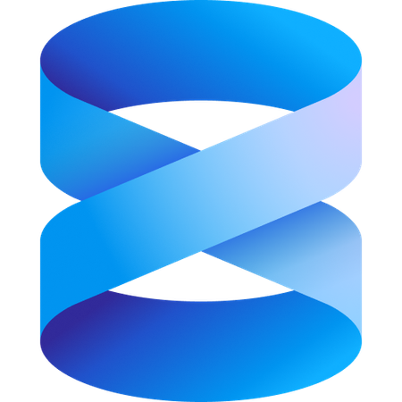
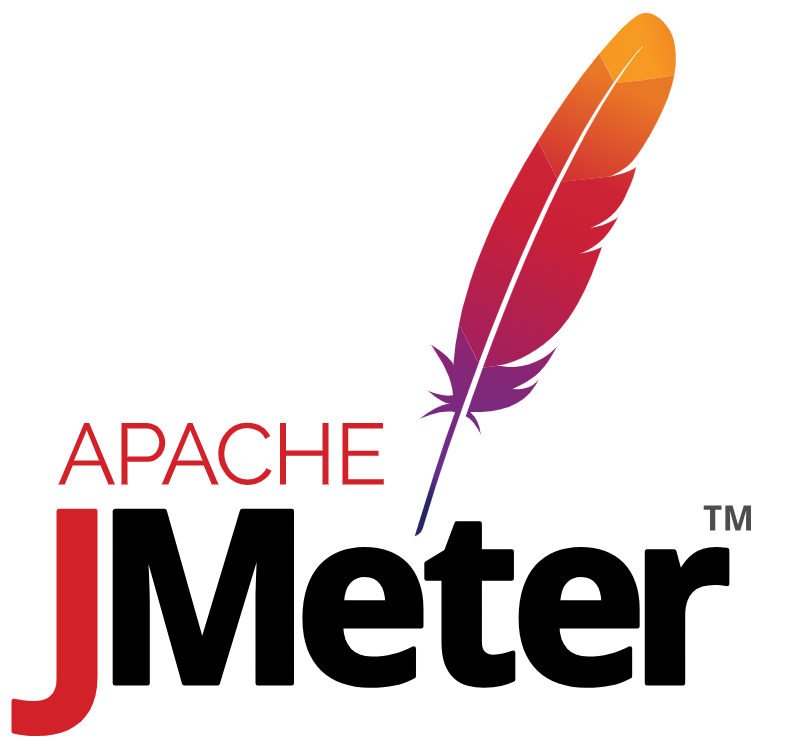

<h1 align="center">Hi 👋, I'm Gilberto Krein</h1>

Sou um profissional focado em construir soluções e resolver problemas complexos. Vindo da Engenharia Civil, desenvolvi uma sólida base analítica, visão sistêmica de projetos e raciocínio lógico avançado (habilidades que hoje canalizo integralmente para o desenvolvimento de software).

🎓 Técnico em Desenvolvimento de Sistemas pelo IFB e graduando em Ciência da Computação. O meu foco diário é construir aplicações robustas, aprimorar a arquitetura de códigos e entender como a tecnologia pode otimizar processos reais.

Vejo minha transição de carreira não como uma mudança de rumo, mas como uma evolução de ferramentas. Sigo focado em expandir meu conhecimento técnico e busco ativamente oportunidades para atuar como Desenvolvedor.

🚀 **Interesses e estudos atuais:** Java, JavaScript, Banco de Dados, Segurança da Informação.

### Connect with me:

<a href="https://buscatextual.cnpq.br/buscatextual/visualizacv.do?id=K9447791U6&tokenCaptchar=0cAFcWeA6s7HJHfeOd9gn3FHLi4E7mdRnB-k27yBwXuDTYN7y5Ga8Ee8YhT_7vBUURskJiMtkXD4iFHzod0gICLX2i3WU1FwJTS_t7vQXf4GaSEpxg-nnu7yZBZaqP3ECa9U05WSR8CqpPInGbIohPAE5F1c_UGsSj5W3E7hbXdC-cAmmKDPS5t0OuDGw0fOh-K90R8_cwluPPIEf8UbExKW4QipoYzQl_svVU6eXxnHlmcP7NM7CTzaPJPK4kQ9mcvGcVAF2kPtR2-vttiPfGltqgZjr8_5nJMjkkJm8_vmqlbQgiCj1eD89OH3sMIsHFjDHc9t_IMmh6qPFNwETJFQunBp6sonWJRmdbRyqaj4fgukd3Xz9dcB0xl6HCq8rw0Tj3wNFP4kn2PaOHxobJFd0mzrcZ9TTK6Oynr7cLIe02j-ZkTUoTVEBsJmetTQ0j_5-qBqivSeqPx2UDJjI2pe_j87p6fWNEIziMib02iCaQTspxedTvthyzxXYtLi_8WvZugus6xV6ioUV4ZswCrppNrH5VzcyCLFyTnhukMSJGlmkiZqAhMjEXXf-a1rBXH8_LMHPav5nvH175saoRe1e3hed62b1EIIKBL_cgb6gTeHi-XdL_PSASvGtPK8mjXWIT2ICsK-S8eip0u6yDBaS-58DqTNVGSff7mImKOew80G_DcM7EPKJOgk0NBXujCsI4Hd7LmMRkWiZpADprClJmAhItRSaDPXbLP5np3gnA6NfzS2qCeFNleTCU_ck2xOVNW74hmtoQNKSs66c9GDyzKV-8QyEL8JZKNOEzjT3GIGNoh1sUdDpbb4KQBN9ydyUH-vps2jBqBxB3cMnvYhUkI_ITAYbU_MjLwigE4KTFSlq8hti5aLdImmHB54Lmo36Sk0BUrgtBWJx6xD3EtY07l6w8oS8WeLMkX3fd7q9PaX5s8RJzFj_d2GC6TiXNR_QNIB4lva5VSBSLs-YBUWLJiAMJekirIDPkkEU-lNPvq6xxe0yOE_ZUYMZrxoljQbGBtQLznDw_oKCHiqx5ovcS_XhSbmEmzGolFQCcfsFmG5zx71LJozcW4-WOdUHE-wtOMqNfaDSoev3vNs5NtbEU_6i-2G_9wGda9dtNHO_DGvMMGkaojYe70RJDqrK1F2u7qfZUnwRuhLnmOl1I-XR7ALgVOkX84GX5f1tmmaNetfSEGr1JJ4o6zjhjZ4sPFaKFggnFjGKUzauDfSeCKqntfCyf3FJ8f-DS5uu3JlmVEVQkkCEvG7peXIWXz2IHgspm3lhdqBiIKmftmwzHhKq80LmLVYPhLmR5aWj_paihj4d8OvESUB5wU3L9dHBcPa_Zm2eT_sHhEvqdhyZYvXcVQWpKMsIFhQ8DhyxX9DwlMd8OR0nyg2AI-N5T-Mm5ebQnpIerk77J94vQUfSpL_-Yn9PKxp1u7CBgzgGratbC2Py_GrJa_b-G2DOuP1CK1Tgx75raUKP_GeEJfk_zOTrMPSsYmBh67lppZeyaiLIF5L1tgYOCYbu2iYnjsQ9GRZkXE8Bpr799WmczU0i92qAO-h6EGjTkDb6WXz_WMJ93CA8JaB8NbMVPwpxvphRqNpWA8dIWyZThgqMbhBzfbE12DxZNnmfcZ-SpCdhGQru5UHlv6fRUsUn73y5TMf1beU7448IWIt5etXsezuBzd7GvJTVYyNpLQOOUkefFYyOws8usq7k3dD3oDqDj1bTwkUhAce0_tbO0YK64ML64aPpqdCh9aRZYI8RUIQMa88EIbMWCiIaKk1AfFwCLEOnhYltlbbgyfrsUqi0zkMU5iGxRxyVN8dSL3_iuYyFOd4c8O7m-weQ9d-l-WCSzBSaRAREq24mMVWo4l7FyUtFR9pe5j7Hd5PsMt1gdz5qfCj0UFc4qOtD9afM_TtkVSWEnYIrA89P-DSvdfJH43H0Fg_UMyESC0SzbH3F9pkhNf-dxBuDnSA5BDP2g8TfftITTm2mlgV4AQD6KmLbgISJcDuEcukdcAnE1m_VI6kezrjplGhyE79IUhzyazBlA9sZ393tq9pZ2XhV3Cjm3-IO8-B6MiS7mOQJHd8dYLBFDWbUQpyeSq9wDqbLo4YJwFvPyqH0t8-vejuqePLJfkm-AnBWG7-3T98w37j3t90odgjMwQWWllbyzAA5Oz3mE0kRvrkMfzCAYHLScbhAA28ykU6c3LPc-5rDnrQ" target="blank"></a>

---

### Languages and Tools:

 
   
   
   
   
   
   
   
   
   
   
   
   
   
   
   
  
  
  
  

  

    
   

<a href="https://astah.net/" target="_blank" rel="noreferrer">
  

---

### 📊 Stats

